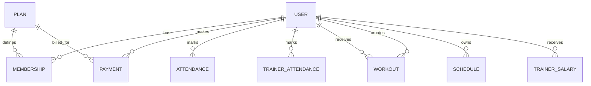

# FitSphere Gym Management System
## Analysis Document and Software Requirements Specification (SRS)

Version: 2.0  
Date: 08-Apr-2026  
Prepared by: Software Analysis Team  
Project Type: Full-stack web application (React + Express + MongoDB)

---

## Document Control

### Revision History

| Version | Date       | Author                  | Change Summary |
|--------:|------------|-------------------------|----------------|
| 1.0     | 08-Apr-2026 | Initial Draft Team      | First project-level analysis and SRS notes |
| 2.0     | 08-Apr-2026 | Software Analysis Team  | Re-structured into detailed, formal SRS with analysis models and traceability |

### Intended Audience
This document is written for stakeholders, project guides, developers, testers, and operations members who need one common requirement baseline. It is intended to be detailed enough for implementation and testing, but still readable for non-developer reviewers. Every major section explains both business intent and technical behavior so that design, coding, and validation stay aligned. The document is based on the current repository implementation and highlights gaps where UI and backend are not fully symmetric.

---

## 1. Introduction

### 1.1 Purpose
The purpose of this SRS is to define what the FitSphere Gym Management System must do, how it should behave, and what quality attributes it must satisfy. This document converts business needs into structured requirements that can be implemented, tested, and reviewed. It also provides analysis artifacts such as data relationships, process flows, and traceability so that decisions are auditable. The goal is to avoid ambiguity and ensure that all roles (member, trainer, admin) get predictable and secure system behavior.

### 1.2 Scope
FitSphere is a multi-role gym management platform used to manage daily gym operations, member services, trainer workflows, and administrative control from a single web system. The system includes authentication, profile management, membership and payment handling, attendance tracking, trainer scheduling, workout assignment, analytics, and salary payout management. The application supports both manual and online payment use cases through Razorpay integration. The scope covers backend REST APIs, frontend role-based UI screens, and persistent data management in MongoDB.

### 1.3 Business Goals
The first business goal is to digitize gym records that are usually handled manually, such as attendance logs, membership validity, and payment history. The second goal is to provide role-specific productivity so that members can self-serve routine actions while trainers and admins get operational dashboards. The third goal is to improve financial visibility through revenue analytics and trainer payout summaries. A final goal is to establish a scalable base architecture that can support future features such as diet planning and notifications.

### 1.4 Definitions, Acronyms, and Abbreviations

| Term | Meaning |
|------|---------|
| SRS | Software Requirements Specification |
| RBAC | Role-Based Access Control |
| JWT | JSON Web Token used for stateless auth |
| REST API | HTTP-based JSON communication interface |
| DFD | Data Flow Diagram for process analysis |
| ER Model | Entity Relationship view of persistent data |
| NFR | Non-Functional Requirement |

### 1.5 References
This SRS is aligned to the current project codebase in this repository. Backend behavior is derived from route handlers under server/routes and schemas under server/models. Frontend routing and access behavior are derived from src/App.jsx, src/pages/AuthContext.jsx, and src/components/ProtectedRoute.jsx. External integration assumptions are based on Razorpay payment flow and SMTP mailer usage in the backend configuration.

### 1.6 Document Overview
Section 2 describes the product context, constraints, and user categories. Section 3 defines detailed functional requirements grouped by module and actor. Section 4 and Section 5 explain interface and data requirements, including business rules and data integrity. Section 6 records quality requirements, and Section 7 provides analysis models for structure and flow. Section 8 onwards define validation, risks, deployment view, and future scope.

---

## 2. Overall Description

### 2.1 Product Perspective
The system follows a client-server architecture where a React frontend calls Express REST APIs over JSON. Authentication is token-based using JWT, and authorization is enforced through backend middleware per role. MongoDB is used as the primary persistent store through Mongoose schemas with reference-based relations. Payment processing for members and trainer salary online flow uses Razorpay, while payment confirmation communication can be sent through SMTP mail integration.

### 2.2 User Classes and Characteristics
Members are end users who mainly consume services such as plan purchase, attendance marking, and workout viewing. Trainers are operational users who manage member workouts, track their own attendance, and maintain schedules. Admin users are super users responsible for managing people, plans, finance records, attendance corrections, and analytics. The system assumes basic digital literacy, browser access, and role-specific login credentials.

### 2.3 Operating Environment
The frontend runs in modern browsers and is developed using Vite tooling. The backend runs on Node.js using Express 5 style routing with ES modules. Data persistence requires a reachable MongoDB instance and valid environment variables for connection and secrets. External payment features require valid Razorpay credentials, and email features require SMTP configuration.

### 2.4 Design and Implementation Constraints
The project uses stateless JWT auth, so token expiration and secure storage are key behavioral constraints. Role restrictions are enforced by middleware, so incorrect role assignment directly affects access behavior. Attendance date fields are stored as string values in YYYY-MM-DD format and trainer salary month in YYYY-MM, which affects query style and analytics grouping. Payment verification relies on cryptographic signature validation and requires strict environment secret consistency.

### 2.5 Assumptions and Dependencies
It is assumed that an admin account is available through seeding or pre-creation because signup is limited to member and trainer roles. It is assumed that client and server clocks are reasonably synchronized since date-based logic is used for attendance and membership activation windows. It is assumed that external services (Razorpay, SMTP) may occasionally fail, and core business operations should still be resilient where possible. It is also assumed that network connectivity is present for all online operations.

### 2.6 In-Scope and Out-of-Scope
In scope includes authentication, role-based dashboards, attendance, membership lifecycle, payments, workout assignment, trainer schedule, admin analytics, and trainer salary payout. In scope also includes CRUD behavior for members, trainers, plans, and key admin operational entities. Out of scope currently includes native mobile app, biometric integration, and advanced recommendation engines. A known partial area is diet management, where UI artifacts exist but a dedicated backend route set is not currently implemented.

---

## 3. Specific Requirements (Functional)

### 3.1 Requirement Notation
Each requirement is tagged with an identifier such as FR-AUTH-01. Priority values are Must, Should, or Could to indicate delivery criticality for release planning. Acceptance intent is described in measurable statements so that test cases can map directly to requirement IDs. All requirements in this section describe expected system behavior, not internal implementation code.

### 3.2 Authentication and Access Control Requirements
This module establishes identity, session continuity, and permission boundaries for all users. Signup accepts member and trainer roles, while admin role is managed separately by governance. Login validates credential pair and issues a signed JWT token for protected API access. Session continuity is provided through profile retrieval endpoint and client-side token persistence.

| ID | Requirement Statement | Priority |
|----|-----------------------|----------|
| FR-AUTH-01 | The system shall allow user signup with roles member or trainer only. | Must |
| FR-AUTH-02 | The system shall validate login credentials and return an auth token on success. | Must |
| FR-AUTH-03 | The system shall expose a protected endpoint to fetch current authenticated user profile. | Must |
| FR-AUTH-04 | The system shall enforce JWT validation for protected APIs. | Must |
| FR-AUTH-05 | The system shall block role-incompatible access using RBAC middleware and UI route guards. | Must |

### 3.3 Member Module Requirements
The member module is designed for self-service operations so that everyday activities do not require admin intervention. Members can update profile fields, view membership status, track attendance, and access payment history. The dashboard presents a compact operational summary including days remaining, monthly attendance, and recent transactions. Member workflows are intended to be simple, low-friction, and transparent.

| ID | Requirement Statement | Priority |
|----|-----------------------|----------|
| FR-MEM-01 | Member shall view and update own profile data for allowed fields. | Must |
| FR-MEM-02 | Member dashboard shall show active membership, recent payments, and attendance metrics. | Must |
| FR-MEM-03 | Member shall check in at most once per day and check out once after check-in. | Must |
| FR-MEM-04 | Member shall view attendance history and current-day attendance status. | Must |
| FR-MEM-05 | Member shall view all membership records with plan linkage. | Must |
| FR-MEM-06 | Member shall view assigned workout plans created by trainer. | Must |
| FR-MEM-07 | Member shall view payment history sorted by latest transactions first. | Must |

### 3.4 Trainer Module Requirements
The trainer module supports service delivery tasks focused on assigned members and daily session planning. Trainers can monitor assigned members, upload workouts, inspect member progress, and maintain schedules. A dedicated trainer attendance flow is included so payroll can be calculated from reliable attendance evidence. The module enforces assignment boundaries to prevent unauthorized workout changes.

| ID | Requirement Statement | Priority |
|----|-----------------------|----------|
| FR-TRN-01 | Trainer dashboard shall show assigned member count, today schedule, and attendance snapshot. | Must |
| FR-TRN-02 | Trainer shall view only members assigned to that trainer account. | Must |
| FR-TRN-03 | Trainer shall create or update workout plans only for assigned members. | Must |
| FR-TRN-04 | Trainer shall view member progress using attendance and workout data. | Must |
| FR-TRN-05 | Trainer shall create and list personal schedules with optional member linkage. | Must |
| FR-TRN-06 | Trainer shall check in/check out and view trainer attendance history. | Must |

### 3.5 Admin Module Requirements
The admin module is the operational control center of the system and includes all high-impact management workflows. Admin users manage member and trainer records, plan catalog, payment records, and attendance corrections. Admin users also create memberships manually and monitor platform health through dashboards and analytics summaries. Since this module can alter financial and identity-linked data, stricter validation and role checks are required.

| ID | Requirement Statement | Priority |
|----|-----------------------|----------|
| FR-ADM-01 | Admin dashboard shall provide aggregate counts and financial overview metrics. | Must |
| FR-ADM-02 | Admin shall list, edit, and delete member records with trainer assignment control. | Must |
| FR-ADM-03 | Admin shall create, update, and delete trainer records including daily rate. | Must |
| FR-ADM-04 | Admin shall create, update, delete, and list membership plans. | Must |
| FR-ADM-05 | Admin shall create and list payment records with method and status fields. | Must |
| FR-ADM-06 | Admin shall create memberships and auto-generate linked payment record for manual flow. | Must |
| FR-ADM-07 | Admin shall list/add/update/delete member attendance entries. | Must |
| FR-ADM-08 | Admin shall list and delete trainer attendance entries. | Must |
| FR-ADM-09 | Admin shall view monthly trainer salary summaries from attendance and daily rate. | Must |
| FR-ADM-10 | Admin shall process trainer salary payout using manual or online flow. | Must |
| FR-ADM-11 | Admin shall view analytics for revenue, signups, and active plan distribution. | Must |

### 3.6 Payment and Membership Lifecycle Requirements
Payment and membership lifecycle is critical because it links finance events with service activation logic. For online payments, the system creates an order, records a pending payment, verifies signature, and then activates membership. For manual admin memberships, payment is directly recorded as paid with cash method and membership is activated immediately. Existing active memberships must be expired before activating a new one to preserve one-active-membership behavior.

| ID | Requirement Statement | Priority |
|----|-----------------------|----------|
| FR-PAY-01 | System shall provide Razorpay public key endpoint for frontend payment initialization. | Must |
| FR-PAY-02 | Member shall create online payment order for active plan purchase. | Must |
| FR-PAY-03 | System shall verify Razorpay signature before marking online payment as paid. | Must |
| FR-PAY-04 | System shall expire existing active memberships before activating new membership. | Must |
| FR-PAY-05 | System shall store pending/paid/failed payment states and transaction references. | Must |
| FR-PAY-06 | System should attempt payment success email notification without blocking core success response. | Should |
| FR-PAY-07 | System shall expose public active plan listing endpoint for purchase discovery. | Must |

### 3.7 Error Handling and Validation Requirements
The system must reject invalid object identifiers, missing required inputs, and inconsistent workflow transitions with clear responses. Unauthorized access attempts must return correct HTTP status and should never leak internal diagnostics. Validation is expected at both route and schema levels to reduce malformed writes. Error messaging must remain user-understandable while preserving backend security practices.

| ID | Requirement Statement | Priority |
|----|-----------------------|----------|
| FR-VAL-01 | Invalid identifier format shall return client error with readable message. | Must |
| FR-VAL-02 | Required field violations shall be rejected before persistence actions. | Must |
| FR-VAL-03 | Duplicate same-day attendance writes shall be blocked by unique constraints. | Must |
| FR-VAL-04 | Payment verification mismatch shall set failed status and deny membership activation. | Must |

---

## 4. External Interface Requirements

### 4.1 User Interface Requirements
The UI shall provide dedicated role-based navigation with clearly separated member, trainer, and admin routes. Unauthorized users shall be redirected to login, and wrong-role users shall be redirected to their own dashboard safely. Dashboard pages shall prioritize actionable information, not only raw tables, to support quick daily operations. Form flows shall provide validation feedback and status indications for success and failure states.

### 4.2 API Interface Requirements
The backend shall expose REST-style JSON endpoints under /api namespace with role-specific route grouping. Protected endpoints shall require Authorization header with Bearer token format. API responses shall use structured JSON objects and meaningful HTTP status codes to enable predictable frontend handling. Public endpoints shall be limited to safe data such as active plans and payment key disclosure.

### 4.3 Third-Party Interface Requirements
Razorpay integration shall be used for online payment order creation and signature verification workflows. SMTP integration shall be used for payment confirmation email where configuration is available. Failure in third-party email delivery shall not invalidate an already successful payment verification. Third-party credentials shall be injected via environment variables and never hard-coded in source.

### 4.4 Communication and Security Interface Requirements
All API communication is expected over HTTPS in production deployment to protect tokens and payment-related payloads. JWT tokens must be validated server-side for every protected request and role checks must be enforced before executing business logic. Sensitive fields such as passwords and secret keys shall never be returned in API payloads. Server logs should avoid printing personally sensitive data in plain form.

---

## 5. Data Requirements and Business Rules

### 5.1 Data Model Overview
The core persistent entities are User, Plan, Membership, Payment, Attendance, TrainerAttendance, Workout, Schedule, and TrainerSalary. User is a polymorphic role entity representing member, trainer, and admin with role-specific optional attributes. Membership links a member to a plan for a bounded date window and status lifecycle. Financial records are split between member payments and trainer salary payouts for clean audit semantics.

### 5.2 Data Dictionary (Summary)

| Entity | Purpose | Key Fields |
|--------|---------|------------|
| User | Identity and role profile | name, email, password, role, status, assignedTrainer, dailyRate |
| Plan | Membership package catalog | name, duration, price, features, status |
| Membership | Active or historical plan assignment | member, plan, startDate, endDate, status |
| Payment | Member payment transaction record | member, plan, amount, method, status, transactionId, date |
| Attendance | Member daily presence log | member, date, checkIn, checkOut, status |
| TrainerAttendance | Trainer daily presence log | trainer, date, checkIn, checkOut, status |
| Workout | Trainer-assigned daily workout | member, trainer, day, exercises[] |
| Schedule | Trainer timing and activity slots | trainer, day, startTime, endTime, activity, members[] |
| TrainerSalary | Monthly trainer payout record | trainer, month, presentDays, dailyRate, amount, status |

### 5.3 Data Integrity and Constraints
Unique email constraint ensures identity uniqueness for user accounts. Unique compound indexes on attendance collections ensure one record per person per date, reducing duplicate check-in anomalies. Trainer salary has unique compound constraint for trainer plus month, which prevents duplicate monthly payout records. Enumerated status fields in plan, membership, payment, and salary models enforce valid lifecycle state transitions.

### 5.4 Business Rules
BR-01: Role shall be one of member, trainer, or admin, and route authorization shall respect this mapping at runtime.  
BR-02: Only one membership may remain active for a member after purchase or admin activation flow.  
BR-03: Payment status lifecycle shall include pending, paid, and failed states with transition checks.  
BR-04: Trainer salary amount shall be computed as presentDays multiplied by dailyRate for selected month.  
BR-05: Trainer workout assignment shall be allowed only for members mapped to that trainer.  
BR-06: Attendance check-in and check-out shall be constrained to one cycle per user per day.

### 5.5 Known Data and Domain Gaps
The current frontend includes diet-related pages, but there is no complete member diet API route in backend routes at this time. This mismatch does not break core auth or payment flows, but it indicates an incomplete feature boundary. The current date handling relies on string formatting in attendance data, which is practical but may complicate advanced timezone analytics. These points should be tracked as engineering backlog items.

---

## 6. Non-Functional Requirements

### 6.1 Security Requirements
Passwords must be hashed before persistence and excluded from serialized API responses. JWT tokens must be verified for protected operations and RBAC checks must run before business logic execution. Payment verification must enforce HMAC signature matching for online flows. Invalid or malicious requests must fail safely with no secret leakage.

### 6.2 Performance Requirements
For typical gym scale workloads, dashboard endpoints should respond within about 2 seconds for normal query volume. List endpoints should support sorted retrieval with bounded front-end pagination strategy where needed. Aggregation-heavy operations such as analytics and salary summaries should be optimized with targeted indexes and controlled date filters. The system should avoid synchronous external dependencies on critical request path where not strictly required.

### 6.3 Reliability and Availability Requirements
The system shall maintain consistent writes for financial and membership operations, ensuring no membership activation occurs on failed signature verification. Unique indexes shall reduce duplicate attendance and duplicate salary records caused by repeated submissions. In case of external service unavailability, critical local data consistency must still be preserved. Health endpoint support shall allow simple operational monitoring.

### 6.4 Usability Requirements
Role-specific routes and layouts should minimize confusion and present only relevant actions to each user class. Validation and error messages should be understandable for non-technical gym staff users. Dashboard summaries should reduce navigation depth for frequent daily actions such as attendance and payments. Navigation should remain predictable across desktop and standard mobile browser widths.

### 6.5 Maintainability Requirements
Code organization should preserve separation between routes, middleware, models, and configuration modules. Environment-driven configuration should allow deployments across local, test, and production setups without code rewrites. Requirement IDs in this document should map to test cases and module ownership to simplify maintenance. Future modules should follow existing route and schema patterns for consistency.

### 6.6 Scalability Requirements
The architecture should support growth in user count by scaling API instances horizontally behind a load balancer in future deployment stages. MongoDB query patterns should remain index-aware for key access paths such as attendance by date and payment by member. Analytics queries may need periodic aggregation or reporting snapshots once data volume increases. Design choices should continue to prefer stateless server behavior for easier scale-out.

---

## 7. Analysis Models

### 7.1 DFD Level 0 (Context Diagram)
This Level 0 DFD (context diagram) treats FitSphere as a single process and shows its main external entities and high-level data exchanges. It reflects the implemented REST API groups (/api/auth, /api/member, /api/trainer, /api/admin, /api/payment) and third-party integrations (Razorpay, SMTP mail). MongoDB is shown as the primary internal data store for persistent records.

```mermaid
flowchart LR
    M[Member]
    T[Trainer]
    A[Admin]
    RZ[Razorpay]
    SMTP[SMTP Mail Service]
    DB[(MongoDB)]

    S((FitSphere Gym Management System))

    M -->|Signup/Login, Profile, Attendance, Membership, Payment, Workout Requests| S
    S -->|Auth Token, Dashboard Data, Membership Status, Attendance/Payment History, Workouts| M

    T -->|Login, Assigned Members, Schedule, Workout Upload, Trainer Attendance| S
    S -->|Auth Token, Member Lists, Schedule Data, Attendance History, Upload Results| T

    A -->|Login, Manage Users/Plans, Attendance Corrections, Reports, Salary Payout Actions| S
    S -->|Auth Token, Admin Dashboards, Analytics, Reports, Salary Summaries/Statuses| A

    S -->|Create Order / Verify Payment| RZ
    RZ -->|Order Id / Verification Response| S

    S -->|Payment Confirmation Email (Best-effort)| SMTP

    S -->|Read/Write Users, Plans, Memberships, Payments, Attendance, Workouts, Schedules, Salaries| DB
    DB -->|Stored Records / Query Results| S
```

### 7.2 DFD Level 1 (Major Processes)
This Level 1 DFD decomposes FitSphere into its major processes and shows how each actor interacts with those processes. It also shows the primary persistent stores in MongoDB and the two external services used during payment flows.

```mermaid
flowchart LR
    %% External entities
    M[Member]
    T[Trainer]
    A[Admin]
    RZ[Razorpay]
    SMTP[SMTP Mail Service]

    %% Processes
    P1((1.0 Auth & Session))
    P2((2.0 Member Services))
    P3((3.0 Trainer Services))
    P4((4.0 Admin Operations))
    P5((5.0 Payments & Verification))

    %% Data stores (MongoDB collections)
    D1[(User)]
    D2[(Plan)]
    D3[(Membership)]
    D4[(Payment)]
    D5[(Attendance)]
    D6[(TrainerAttendance)]
    D7[(Workout)]
    D8[(Schedule)]
    D9[(TrainerSalary)]

    %% Actor -> Auth
    M -->|Signup/Login| P1
    T -->|Login| P1
    A -->|Login| P1
    P1 -->|JWT Token / Profile| M
    P1 -->|JWT Token / Profile| T
    P1 -->|JWT Token / Profile| A
    P1 -->|Create/Validate User, Fetch Profile| D1
    D1 -->|User Records| P1

    %% Member services
    M -->|Profile, Attendance, Membership, History, Workout View| P2
    P2 -->|Dashboard Data, Status, Lists| M
    P2 -->|Read/Write Profile| D1
    P2 -->|Read Active Plans| D2
    P2 -->|Read/Write Membership| D3
    P2 -->|Read Payment History| D4
    P2 -->|Read/Write Attendance| D5
    P2 -->|Read Workouts| D7

    %% Trainer services
    T -->|Assigned Members, Workout Upload, Schedule, Trainer Attendance| P3
    P3 -->|Lists, Upload Result, Schedule View, Attendance History| T
    P3 -->|Read Assigned Members| D1
    P3 -->|Read/Write Workouts| D7
    P3 -->|Read/Write Schedule| D8
    P3 -->|Trainer Attendance Read and Write| D6
    P3 -->|Read Member Attendance for Progress| D5

    %% Admin operations
    A -->|Manage Users/Plans, Records, Analytics, Salary Ops| P4
    P4 -->|Dashboards, Reports, Summaries| A
    P4 -->|CRUD Users| D1
    P4 -->|CRUD Plans| D2
    P4 -->|CRUD Memberships| D3
    P4 -->|CRUD Payments| D4
    P4 -->|CRUD Attendance| D5
    P4 -->|List/Delete Trainer Attendance| D6
    P4 -->|Read/Write Trainer Salary| D9

    %% Payments & verification
    M -->|Create Order / Verify Payment| P5
    A -->|Salary Payout (Manual/Online)| P5
    P5 -->|Payment Result / Status| M
    P5 -->|Payout Result / Status| A
    P5 -->|Create/Verify Order & Signature| RZ
    RZ -->|Order Id / Verification| P5
    P5 -->|Best-effort Confirmation Email| SMTP
    P5 -->|Write Payment Status| D4
    P5 -->|Activate/Expire Membership| D3
    P5 -->|Update Salary Status (if payout tracked)| D9
```

### 7.3 ER Analysis View
The data model centers around User as the actor root and then branches into member-centric and trainer-centric records. Membership and Payment form the core financial-service linkage for members. Attendance and TrainerAttendance provide daily operational evidence for service and payroll logic. TrainerSalary uses month-based grouping for payout lifecycle and keeps payment proof metadata.



### 7.4 Key Use Cases (Textual Summary)
UC-01 User Authentication: User signs up or logs in, system validates credentials, returns token, and client stores session context.  
UC-02 Member Attendance Flow: Member checks in once daily, check-out updates same record, and dashboard reflects attendance totals.  
UC-03 Trainer Workout Assignment: Trainer selects assigned member, uploads workout, and member sees update in workout view.  
UC-04 Membership Purchase: Member creates payment order, completes payment, system verifies signature, and activates membership.  
UC-05 Trainer Salary Payout: Admin generates salary summary, pays via manual or online flow, and monthly record is updated.

---

## 8. Verification, Validation, and Traceability

### 8.1 Validation Strategy
Requirement validation shall be performed using API tests, UI integration checks, and data integrity verification at database level. Functional tests should cover normal paths, role violation paths, and invalid input paths for each module. Payment and salary flows require positive and negative signature verification scenarios. Regression checks should ensure one module change does not break role-based routing or dashboard summaries.

### 8.2 Acceptance Criteria (Module-Level)
Authentication is accepted when token issuance, protected profile fetch, and role guard redirects all behave correctly. Member module is accepted when profile update, attendance cycle, payment history, and dashboard metrics are consistent with database state. Trainer module is accepted when assignment-restricted workout operations and trainer attendance workflows pass. Admin module is accepted when management CRUD and salary workflows produce expected persistent records.

### 8.3 Requirement Traceability Matrix (Sample)

| Requirement ID | Primary API/Module | Validation Method |
|----------------|--------------------|-------------------|
| FR-AUTH-02 | /api/auth/login | Positive and negative credential tests |
| FR-MEM-03 | /api/member/attendance/checkin, /checkout | Duplicate prevention and sequence test |
| FR-TRN-03 | /api/trainer/workout | Assigned vs unassigned member authorization test |
| FR-ADM-09 | /api/admin/trainer-salaries | Month summary calculation verification |
| FR-PAY-03 | /api/payment/verify | Signature mismatch and success path tests |
| FR-VAL-03 | Attendance schema unique index | Repeated request conflict behavior test |

---

## 9. Risks and Mitigation

### 9.1 Identified Risks
Risk 1 is third-party outage in Razorpay or SMTP causing partial transaction communication issues. Risk 2 is environment misconfiguration (missing secrets) resulting in auth or payment feature failure. Risk 3 is data inconsistency due to manual admin edits if validation is bypassed in future code changes. Risk 4 is feature mismatch between frontend screens and backend route availability for partially implemented modules.

### 9.2 Mitigation Plan
Use startup configuration checks for critical environment variables and provide explicit health diagnostics. Keep signature verification and role guards mandatory in code review checklist for every release. Expand automated regression suite for membership, payment, and salary workflows because they are financially sensitive paths. Track UI-backend parity as a release gate item so placeholder pages do not appear complete before API support exists.

---

## 10. Deployment and Operational Notes

The application can run full stack using concurrent frontend and backend development scripts defined in package configuration. Production deployment should serve frontend build artifacts through a static host and run backend behind reverse proxy with HTTPS termination. MongoDB backup strategy should include periodic snapshots because attendance and payment data are operationally critical. Logging should include request IDs and sanitized error traces to support faster incident diagnosis.

---

## 11. Future Enhancements

Future enhancement 1 is complete diet planning module with backend APIs, trainer recommendations, and member adherence tracking. Future enhancement 2 is notification center for reminders on plan expiry, attendance streaks, and payment confirmations. Future enhancement 3 is richer analytics such as churn risk, trainer utilization, and cohort-based revenue insights. Future enhancement 4 is multi-branch support for gyms with separate location-level dashboards and permissions.

---

## Appendix A: Current API Surface Summary

### Public
- GET /api/plans
- GET /api/payment/key
- GET /api/health

### Auth
- POST /api/auth/signup
- POST /api/auth/login
- GET /api/auth/me

### Member
- GET /api/member/profile
- PUT /api/member/profile
- GET /api/member/dashboard
- POST /api/member/attendance/checkin
- PUT /api/member/attendance/checkout
- GET /api/member/attendance
- GET /api/member/attendance/today
- GET /api/member/membership
- GET /api/member/workouts
- GET /api/member/payments

### Trainer
- GET /api/trainer/dashboard
- GET /api/trainer/members
- POST /api/trainer/workout
- GET /api/trainer/member/:id/progress
- GET /api/trainer/schedule
- POST /api/trainer/schedule
- POST /api/trainer/attendance/checkin
- PUT /api/trainer/attendance/checkout
- GET /api/trainer/attendance
- GET /api/trainer/attendance/today

### Admin
- GET /api/admin/dashboard
- GET /api/admin/members
- PUT /api/admin/members/:id
- DELETE /api/admin/members/:id
- GET /api/admin/trainers
- POST /api/admin/trainers
- PUT /api/admin/trainers/:id
- DELETE /api/admin/trainers/:id
- GET /api/admin/plans
- POST /api/admin/plans
- PUT /api/admin/plans/:id
- DELETE /api/admin/plans/:id
- GET /api/admin/payments
- POST /api/admin/payments
- POST /api/admin/memberships
- GET /api/admin/attendance
- POST /api/admin/attendance
- DELETE /api/admin/attendance/:id
- GET /api/admin/trainer-attendance
- DELETE /api/admin/trainer-attendance/:id
- GET /api/admin/trainer-salaries
- POST /api/admin/trainer-salaries/pay
- POST /api/admin/trainer-salaries/create-order
- POST /api/admin/trainer-salaries/verify
- GET /api/admin/analytics

---

End of Document
